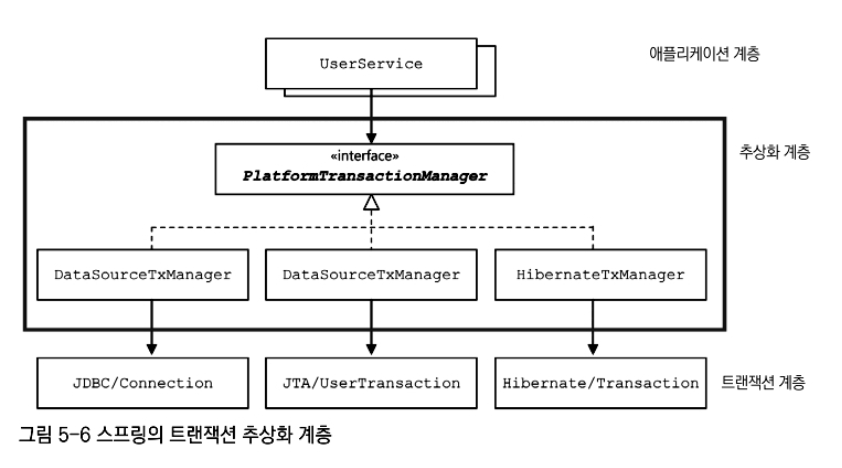

# [Spring] TransactionManager

# 들어가기 전 

Spring의 트랜잭션 매니저는 PlatformTransactionManager라는 추상화를 통해 다양한 데이터 접근 기술에 대해 일관된 트랜잭션 처리를 제공한다. 그러나 실전에서는 단일 트랜잭션 경계만으로 설명되지 않는 복잡한 상황이 자주 등장한다. 특히 복수의 데이터소스, 이벤트 기반 처리, 비동기 작업 등이 혼재하는 환경에서는 Spring의 추상화 이면을 명확히 이해하고 있어야 한다. 본 글은 이러한 맥락에서 트랜잭션 매니저의 역할, 동기화 메커니즘, 컨테이너 내부 동작 방식, 이벤트 연계와 경계의 모호성까지 작성하고자 한다.

# TransactionManager의 추상화 

Spring의 트랜잭션 매니저는 단순히 데이터베이스 트랜잭션을 제어하는 기술적 역할을 넘어 본질적인 애플리케이션의 상태 전이와 도메인 경계를 명확히 정의하고 시스템의 일관성을 보장하는 논리적 단위의 경계자 역할을 수행한다.
이 때 TransactionManager는 하나의 트랜잭션 단위로 묶어 시스템 레벨에서 "이 순간을 경계로 상태를 확정짓는다"는 설계적 의도를 표현하는 수단으로 활용되기 떄문에 이런 관점에서 보면 트랜잭션 매니저는 단순한 API가 아니라 복잡한 분산 시스템 안에서 업무 단위의 확정(commit)을 선언하는 존재이며 그것이 적절히 작동하지 않으면 비즈니스 로직은 오류 없이 실행되었더라도 도메인 모델의 불일치라는 더 깊은 오류를 만들어낸다.

<br> 

Spring은 PSA(Portable Service Abstraction)라는 아키텍처 철학을 기반으로 다양한 기술 스택을 추상화한다.
PSA는 JDBC, JPA, JMS, JTA 등 서로 다른 요구 사항을 가지는 기술에 대해 동일한 프로그래밍 모델을 제공하는 것을 목표로 하며 트랜잭션 영역에서는 PlatformTransactionManager로 설계되었다.
PlatformTransactionManager 는 다음 세가지 핵심 책임을 통해 동일한 프로그래밍 모델을 제공하는 인터페이스로서 존재한다. 

<br> 

- 트랜잭션 시작 (getTransaction)
- 커밋 (commit)
- 롤백 (rollback)

<br> 

Spring은 DataSourceTransactionManager, JpaTransactionManager, JtaTransactionManager와 같은 다양한 구현체를 제공한다.
이들 구현체는 각각 JDBC 기반의 단일 커넥션 트랜잭션, JPA의 EntityManager와 영속성 컨텍스트를 중심으로 한 트랜잭션, 그리고 분산 환경을 고려한 JTA 기반 트랜잭션을 구현한다.
그 결과 개발자는 트랜잭션의 구체적인 구현 방식이나 자원 관리에 대한 세부 사항을 인지하지 않아도 되며 단지 @Transactional이라는 선언형 어노테이션을 통해 일관된 트랜잭션 처리를 적용할 수 있다.

<br> 



<br> 

Spring의 트랜잭션 PSA는 트랜잭션의 추상 계약을 PlatformTransactionManager로 통일하고 실제 자원 관리와 트랜잭션 모델의 차이는 구현체에 위임함으로써 개발자에게는 @Transactional이라는 단일한 프로그래밍 모델만을 노출한다.

<br> 


# 트랜잭션 동작 구조

## TransactionInterceptor


@Transactional 어노테이션 선언이 실제 의미를 가지기 시작하는 지점은 그것을 가로채는 객체 즉 TransactionInterceptor가 개입하는 순간이다.
TransactionInterceptor는 단순히 "메서드 실행 전 트랜잭션을 열고 예외가 나면 롤백한다"는 수준의 컴포넌트가 아닌 ‘트랜잭션 경계 후보’로 승격시킬지 여부를 판단하고 그 판단 결과를 PlatformTransactionManager에게 위임하는 데 있다.
TransactionInterceptor는 트랜잭션을 직접 시작하지 않는다. 대신 "이 호출은 트랜잭션으로 다뤄져야 하는가?"라는 질문을 시스템에 던지는 결정 지점이다. 

<br> 

Spring에서 트랜잭션은 메서드에 묶이지 않는다. 트랜잭션은 항상 메서드 호출 시점의 실행 컨텍스트에 귀속된다.
TransactionInterceptor 는 TransactionAttribute, 현재 스레드에서 트랜잭션 동작 여부 이 두 정보를 바탕으로 트랜잭션 경계 전략을 결정하고 결정된 전략을 PlatformTransactionManager에 위임한다.
소스로 살펴보면 다음과 같다. 

<br> 

```java
protected Object invokeWithinTransaction(Method method, @Nullable Class<?> targetClass,
        final InvocationCallback invocation) throws Throwable {

    // If the transaction attribute is null, the method is non-transactional.
    TransactionAttributeSource tas = getTransactionAttributeSource();
    final TransactionAttribute txAttr = (tas != null ? tas.getTransactionAttribute(method, targetClass) : null);
    final TransactionManager tm = determineTransactionManager(txAttr, targetClass);
    
    ... 
    
}
```

<br>

소스코드는 참으로 간단하게 추상화되어 있다. TransactionAttribute가 존재 유무를 통해 트랜잭션 메서드인지 확인하고 propagation, isolation 과 같은 TransactionAttribute에 맞는 트랜잭션 매니저 결정을 위임한다.

## 트랜잭션의 결정에서 실행으로

TransactionInterceptor의 역할은 어디까지나 트랜잭션 경계를 해석하는 데 있다.
이 단계에서 트랜잭션은 아직 시작되지 않았으며 어떠한 데이터베이스 커넥션도, 영속성 컨텍스트도 획득되지 않는다.
중요한 전환점은 TransactionInterceptor가 판단한 트랜잭션 경계 전략을 실제 실행 계층에 위임하는 순간이다.

<br> 

```java
TransactionStatus status = transactionManager.getTransaction(transactionDefinition);
```

<br> 

이 호출은 단순히 “트랜잭션 상태 객체를 얻는다”는 의미를 넘어 앞서 결정된 트랜잭션 경계를 물리적 실행 단위로 구체화하라는 요청에 가깝다.
즉 이 지점부터 트랜잭션은 개념이 아니라 실행 상태가 된다. 

<br> 

하지만 getTransaction이 트랜잭션의 물리적 시점을 나타내지는 않는다.
실제 트랜잭션의 물리적 시작은 이 메서드 내부에서 조건적으로 발생한다.
getTransaction()은 항상 트랜잭션을 여는 메서드가 아니라 현재 실행 컨텍스트와 트랜잭션 속성을 종합해 새 트랜잭션이 필요한지 여부를 판단하는 진입점이다.
이 파단 로직은 모든 구현체들이 공용으로 사용할 수 있는 AbstractPlatformTransactionManager에 구현되어 있으며 기존 트랜잭션의 존재 여부, propagation 규칙에 따라 트랜잭션 참여, 중단(suspend), 혹은 신규 트랜잭션 시작 중 하나를 선택한다.

<br> 

## 물리 트랜잭션의 시작과 구현체의 책임

이제 실제 트랜잭션이 생성되는 지점을 살펴볼 차례다.
새로운 트랜잭션이 필요하다고 판단된 경우에만 AbstractPlatformTransactionManager는 트랜잭션 시작을 구체 구현체에 위임한다. 
이 위임 지점이 바로 doBegin()이다.

중요한 점은, 이 시점까지의 흐름—트랜잭션 필요 여부 판단, propagation 규칙 해석, 기존 트랜잭션 존재 여부 확인은 모두 추상 클래스인 AbstractPlatformTransactionManager에 공통으로 구현되어 있다는 사실이다.
즉 트랜잭션의 의미적 경계와 실행 정책은 구현체와 무관하게 동일하게 처리된다.

구현체가 개입하는 지점은 오직 하나 그 경계를 실제 실행 가능한 물리 트랜잭션으로 어떻게 표현할 것인가에 대한 부분이다. 
이 책임이 doBegin()을 통해 각 구현체로 위임된다.

JpaTransactionManager를 예로 들면 doBegin()은 데이터베이스 커넥션을 직접 제어하는 대신 JPA의 EntityManager와 영속성 컨텍스트를 트랜잭션 경계에 결합하는 방식으로 물리적 트랜잭션을 구성한다.

이 과정에서 EntityManagerFactory로부터 생성되거나 이미 스레드에 바인딩된 EntityManager가 재사용되며 해당 EntityManager는 TransactionSynchronizationManager를 통해 현재 트랜잭션 경계에 귀속된다.
그 결과 해당 경계 내에서 수행되는 모든 JPA 접근은 동일한 EntityManager와 동일한 영속성 컨텍스트를 공유하게 된다.

반면 DataSourceTransactionManager는 동일한 추상 흐름 위에서 동작하되 EntityManager가 아닌 데이터베이스 커넥션을 중심으로 트랜잭션을 구성하며 autoCommit 제어와 커넥션 바인딩을 통해 물리적 트랜잭션을 표현한다.

즉 두 구현체의 차이는 트랜잭션의 정책이나 경계 정의에 있지 않다.
차이는 오직 추상적으로 정의된 트랜잭션 경계를 어떤 자원 모델로 실현하느냐에 있다.
    


<br> 

# 경계의 중요성

지금까지 살펴본 Spring 트랜잭션의 구조는 매우 정교하다.
트랜잭션의 경계 해석은 TransactionInterceptor가 담당하고 경계의 실행 정책은 AbstractPlatformTransactionManager에 공통으로 정의되며 물리 자원에 대한 제어만이 각 구현체로 위임된다. 

<br> 

이 구조만 놓고 보면, Spring의 트랜잭션 추상화는 데이터 접근 기술의 차이를 완벽히 은폐하고 일관된 트랜잭션 모델을 제공하는 것처럼 보인다.
실제로 단일 데이터소스, 단일 트랜잭션 매니저 환경에서는 이 추상화가 문제를 일으킬 여지는 거의 없다. 

그러나 실전 시스템은 대부분 이 전제를 벗어난다. 
MultiDataSource, MultiTransactionManager 그리고 이벤트 기반 처리나 비동기 작업이 결합되는 순간 트랜잭션의 경계는 더 이상 하나의 선으로 설명되지 않는다. 

[//]: # (## 트랜잭션 매니저 환경에서의 이벤트 동기화 실패)

[//]: # ()
[//]: # (예를 들어 여러 개의 트랜잭션 매니저가 동시에 사용되는 배치 오케스트레이션 코드가 있다고 가정해보자. )

[//]: # ()
[//]: # (<br> )

[//]: # ()
[//]: # ()
[//]: # ()
[//]: # (<br> )

[//]: # (이 코드는 서로 다른 데이터소스와 트랜잭션 매니저를 사용하는 상황에서 트랜잭션 경계 밖에서 이벤트가 발행될 경우 어떤 문제가 발생할 수 있는지를 보여준다.)

[//]: # (<br> )

[//]: # ()
[//]: # (하지만 여기서 단순히 트랜잭션을 시작하고 커밋하거나 롤백하는 역할을 넘어 트랜잭션 매니저는 트랜잭션의 경계를 명확히 정의함으로써 시스템 전체의 일관성을 유지하는 책임 단위를 형성한다.)

[//]: # ()
[//]: # (다시 말해, 트랜잭션 매니저는 하나의 유스케이스가 논리적으로 완결되었다고 판단되는 시점과 그 결과가 시스템 레벨에서 **불변성&#40;consistency&#41;**으로 승격되는 시점을 규정한다.)

[//]: # ()
[//]: # (이러한 관점에서 트랜잭션 매니저는 단순한 기술적 인프라 구성 요소가 아니라 도메인 수준의 경계&#40;Bounded Context&#41;와 일관성의 범위를 명시적으로 드러내는 설계 도구로 이해되어야 한다.)


<br> 

아래는 실무에서 자주 맞닥뜨리는 경계 혼선의 예시들이다. 코드는 단순화했지만 맥락은 그대로다. 

<br> 

### 예시 1. 두 개의 트랜잭션 매니저와 동일 이벤트

하나의 유스케이스에서 두 데이터소스를 갱신하고 같은 이벤트를 발행하려는 경우다.

<br> 

```java
@Transactional("orderTx")
public void placeOrder() {
    orderRepository.save(order);

    // 다른 데이터소스
    paymentService.capture(order.getId()); // @Transactional("paymentTx")

    // 동일 이벤트
    eventPublisher.publishEvent(new OrderPlaced(order.getId()));
}
```

이 시점의 event는 어느 트랜잭션에 귀속될까 ??  
`orderTx`와 `paymentTx`의 커밋 시점이 분리되어 있다면 이벤트의 처리 결과는 둘 중 하나만 반영된 상태에서 실행될 수 있다. 결국 문제는 "이 이벤트의 경계가 누구의 경계인가"로 수렴한다.

<br> 

### 예시 2. @TransactionalEventListener와 비동기 리스너

커밋 이후 이벤트를 처리하려는 의도는 좋지만, 비동기 리스너가 섞이는 순간 경계는 다시 흐려진다.

<br> 

```java
@TransactionalEventListener(phase = AFTER_COMMIT)
public void onOrderPlaced(OrderPlaced event) {
    asyncExecutor.execute(() -> slackNotifier.send(event));
}
```

트랜잭션은 커밋되었지만, 비동기 실행은 별도의 스레드다.  
보장되는 것은 "커밋 이후에 호출"뿐이며 이벤트가 참조하는 데이터가 다른 트랜잭션에서 아직 커밋되지 않았다면 데이터 정합성은 여전히 보장되지 않는다.

<br> 

### 예시 3. 트랜잭션 외부에서의 이벤트 발행

정교한 경계를 만들려고 하다가 의도치 않게 경계를 벗어나는 경우도 흔하다.

<br> 

```java
public void placeOrder() {
    transactionTemplate.execute(status -> {
        orderRepository.save(order);
        return null;
    });

    eventPublisher.publishEvent(new OrderPlaced(order.getId()));
}
```

<br> 

눈으로 보기엔 "트랜잭션 안에서 저장, 밖에서 이벤트"지만 실상은 이벤트가 어떤 경계에도 속하지 않는다.  
이 순간부터 이벤트 처리의 성공/실패는 비즈니스 일관성과 직접적인 상관이 없어지고, 시스템은 '운'에 맡기는 구조가 된다.

<br> 

요약하면 TransactionManager는 기술적 구성요소가 아니라 "무엇이 확정되는 순간인가"를 선언하는 경계다.  
이 경계가 모호해질수록 시스템의 일관성은 설계가 아니라 우연에 기대게 된다.

<br> 

오탈자 및 오류 내용을 댓글 또는 메일로 알려주시면, 검토 후 조치하겠습니다.
